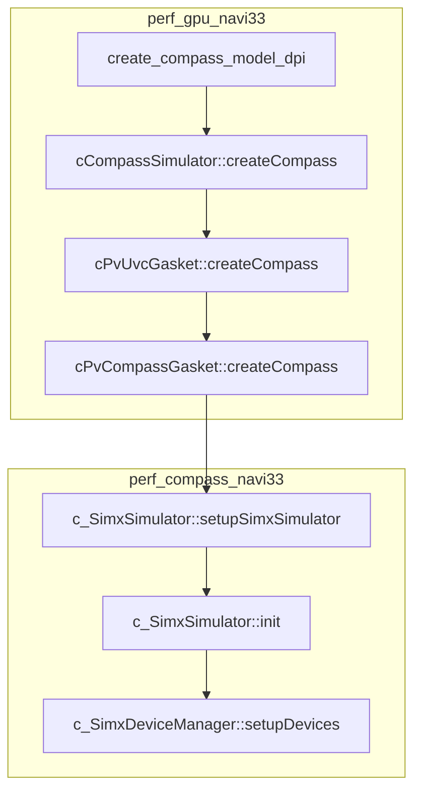

# Compass

PV: Performance Validation

## path

```yml
vcs compile log: out/linux_3.10.0_64.VCS/navi33/config/gc/pub/sim/vcs_compile.log

testcase logs:
    path        : out/linux_3.10.0_64.VCS/navi33/config/gc/run/block/<case_name>
    vcs         : vcs_run.log
    compass     : gc_uvm_tb.amd_sdp_dpi_env.sdp0_data_completer_top.uvc.pv_sdp_txn.log
    trace       : perf_compass_generic_sdptrace_replay_device-dbgu0_0_p0_65555.sdp_trc

dj compass lib: out/linux_3.10.0_64.VCS/navi33/common/pub/bin/compass
    - libcompass_debug.so
    - libcompass_release_gprint.so

perf_gpu_navi33 source:
    dts             : src/test/compass_cfgs/variant/navi33/PV_Navi33-SoC.dts.xml

perf_compass_navi33 source:
    sdpTraceWriter  :
        - src/package/protocolFiles/sdpprotocolFiles/sdpTraceWriter.cpp
        - src/package/configs/sdpTraceWriter.cfg
```

## compile compass

Debug Mode

```dj
// perf_gpu_navi33/src/verif/tools/stomp/stomp_compass/src/stompPerfGpuInterfaceFiles/album.dj

component perf_gpu do |variant, tbtype|
    if ENV['PERF_COMPASS_DEBUG_BUILD'].to_i == 1
        need perf_compass::build_compass(:dll, :debug)
    else
        need perf_compass::build_compass(:dll, :release_gprint)
    end
end
```

## dj

```sh
dj [options] ...

    -i              : single-step debugging

    -DRUN_DV=ONLY   : skip compiling

    clean           : clear workspace
```

```ruby
component :dc do |variant...|
    entity :my_design do
        need register_files, test_library
        action :build do; end
    end

    entity :register_files do; end
    entity :test_library do; end
end

dj -v dc::my_design.build
```

```ruby
# Define a component-type
component :aaa do |var_arg|
    entity :top do
    end
end

# Instantiate a component in a design
design :design_name do
    # instantiate a component-instance of component-type aaa, named aaa_0
    component aaa(:var_a), as: :aaa_0
end
```

## DTS

device topology specification

```cpp
// perf_compass_navi33/src/package/compassInfraFile/simxSharedFiles/simx_deviceManager.cpp

class c_SimxDeviceManager {
    void parseDtsFile(string x_filename) { parseDtsString(file_content); }
    void parseDtsString(string x_buffer) {
        XML_Parser l_parser = XML_ParserCreate(NULL);
        XML_SetUserData(l_parser, this);
        XML_Parse(l_parser, x_buffer);
    }
    void startElement(void *x_data, const char *x_element, const char *x_attr) {
        c_SimxDeviceManager *me = x_data;
        string l_token = x_element;
        if (l_token == "device") { }
        else if (l_token == "peer") { }
        else if (l_token == "link") {
            me->m_currLinkInfo = c_SimxDtsLinkInfo(l_type, l_dest, l_src, l_subordinating, l_name, l_options);
        }
    }
    void endElement(void *x_data, const char *x_element) {
        string token = x_element;
        if (token == "device") {
            me->m_currDevice = NULL;
            me->m_buildingNullDevice = false;
        } else if (token == "link") {
            me->createLink(me->m_currLinkInfo);
            me->m_currLinkInfo.type("");
        }
    }

    c_SimxTimingLink *createLink(c_SimxDtsLinkInfo &x_info) {
        c_SimxTimingLink *l_link = m_linkRegistry[x_info.type()]->createLink(x_info);
        return l_link;
    }
};
```

```cpp
// perf_compass_navi33/src/package/deviceFiles/socdetailedfabricdeviceFiles/sdporiginator_fabric.cpp

namespace {
    c_RegisterLink<c_SimxSdpLink> linkRegistration = c_RegisterLink<c_SimxSdpLink>("simxsdplink_fabric2umc");

    c_RegisterLink<c_SimxSynchronizedSdpLink> synchronizedLinkRegistration = c_RegisterLink<c_SimxSynchronizedSdpLink>("simxsynchronizedsdplink");
}
```

```cpp
// perf_compass_navi33/src/package/deviceFiles/sdpcompletordeviceFiles/sdpcompletordevice.cpp

/*.....................................................................*/
// Register your devices and links with the device manager.
// This lets it know how to create your types when it encounters your
// strings in the DTS file.
namespace {
    c_RegisterDevice<c_SdpCompletorDevice> deviceRegistration = c_RegisterDevice<c_SdpCompletorDevice>("sdpcompletordevice");

    c_RegisterLink<c_SimxSdpLink> linkRegistration = c_RegisterLink<c_SimxSdpLink>("simxsdplink");

    c_RegisterLink<c_SimxSynchronizedSdpLink> synchronizedLinkRegistration = c_RegisterLink<c_SimxSynchronizedSdpLink>("simxsynchronizedsdplink");
}
```

```cpp
// perf_compass_navi33/src/package/compassInfraFiles/simxSharedFiles/simx_deviceManager.hpp

template <typename T>
inline T* c_RegisterLink<T>::createLink(c_SimxDtsLinkInfo &x_info) {
    return new T(x_info);
}
```

```cpp
// perf_compass_navi33/src/package/deviceFiles/socdetailedfabricdeviceFiles/sdpcompletor_fabric.cpp

class c_SdpCompletorFabric : public c_SimxStatDevice {
    c_SdpCompletorFabric(...) {
        // ...

        x_parent->registerKnob(&m_sdpTraceWriterEnable, "sdpTraceWriterEnable");

        // ...
    }

    // output file: perf_compass_generic_sdptrace_replay_device-dbgu0_0_p0_65555.sdp_trc
    void enableSdpTraceWriter(c_SimxSdpLink *x_link, uint32 x_port) {
        string outFileName = c_SimxKnobParser::configParser()->get_string("outFileName");
        auto traceWriter = new c_SimxSdpTraceWriter(f"{outFileName}_{x_link->source()}_p{x_port}", getDeviceId());
        x_link->linkController(traceWriter);
    }
}
```

## FTS

```cpp
// perf_compass_navi33/src/package/deviceFiles/socfabricftsdeviceFiles/socfabrictopologyspec.cpp

class c_CompassSocFabricTopologyReader {
    c_CompassSocFabricTopologySpec parseFtsFile(string x_filename) {
        parseFtsString(file_content);
    }
}
```

## SDP

```cpp
// perf_compass_navi33/src/package/protocolFiles/sdpprotocolFiles/sdpLink.cpp

class c_SimxSdpLink : public c_SimxTimingLink {
    virtual void linkController(c_SimxSdpLinkController *);
}
```

```cpp
// perf_compass_navi33/src/package/protocolFiles/sdpprotocolFiles/sdpTraceWriter.cpp

class c_SimxSdpTraceWriter : public c_SimxSdpLinkController, public c_SimxKnobParser {
    void writeSdpRequestsToTraceFile();
    void writeSdpResponsesToTraceFile();
    void writeSdpDataToTraceFile();
}
```

## test

```c
// src/test/suites/block/perf/tgl/tglFillrate/PRTtest.dv

TGLPV_CB_VM_FLAT_PTE_256K(tglfillrate_c64_w_aa1)
```

## commands

```sh
# enable pv
dj [OPTIONS] \
    -DPERF_TESTING \
    -DMEMSYS_PERF \
    -DConfigBU \
    -DGCEA_16GB
```

## ini

```sh
-COMPASS_CMD_LINE="opt1 opt2=1 ..."
# generated pvCompass.cfg

# gpat ?
-config=pvCompass.cfg
```

## dv files

```c
// parameters
tool.sim_run.args
tool.sim_gen_ini.args
```

### structure

```yml
src/test/suits/block/testeron/variant/navi33/test.dv:
    MEMSYS_PERF:
        pv_gfx_ip.dv:
            sim_gen_ini:
                COMPASS_CMD_LINE:
                    -UnusedCmdlinkKnobsAreErrors
            perf_gpu.dv:
                global_envs.m4
                perf_gpu_features.m4
                perf_gpu_variant.dv:
                    pv_configs.yml
                    pv_nv33.yml
                pv_memorg_mclk.dv
                pv_clock_periods.dv
        pv_rv_soc.dv
        pv_gfx_ip.yml
    ConfigBU:
    GCEA_16GB:
        gcea.navi33.ini
```

### perf_gfx.dv

```c
// perf_gpu/src/meta/flows/perf_gfx.dv
// perf_gpu_navi33/src/meta/flows/perf_gfx.dv

// -D PERF_TESTING macro is used to determine whether 
// the sim is being run as local sim using -D macros or in GNB WebUI/XNB
define(XNB_TEST,
    $1 = testname
    $2 = test group
    $3 = mem config macro : used for GNB regression and XNB sims; for GFX regressions, must use -DUSE_* macro defined in testeron/variant/<project>/test.dv
    test $1 +=
        ifdef(PERF_TESTING,,
            // use only for GNB regression and XNB sims
            conf = XNB_GFX_CONFIG
            // following required if XNB_GFX_CONFIG is full gnb
            simopts += -PCIE=440000000_400000000_000000000 -IOC_SCOREBOARD_ENABLE -SKIP_PCIEINIT
            $3

            ifdef(XNB,
                soc_test_group += xnb_perf_$2
                // add following two arguments to place RB in FB for TGL-based tests (see UBTS 409854)
                args += -tc_ulPM4RingParentHeap=24
                args += -tc_ulPM4IBufferParentHeap=24
            )
        )
        flow.prefix += perf_
        when += gnb_perf_$2
    endtest
)
```

### chiplevel.dv

```c
// src/meta/flows/chiplevel.dv

ifdef(`PERF_TESTING,
    const FULLCHIP_EMU_MAXCLOCK = 20000000
,
    const FULLCHIP_EMU_MAXCLOCK = 5000000
)
```

### gfx.dv

```c
// src/meta/flows/gfx.dv

flow chip_gfx_check, chip_gfx_x
    // karlm -- disable se_check for now
    // se_check
    // amys -- don't use when ncsim, can't run sim_run
    // jesu -- add trick for performance compress function;
    // if defined PERF_TESTING, flow pv_regress_flow will always run;
    // if not defined PERF_TESTING, follow original flow:
    // if se_check pass, then go on next tool; if se_check fail, then quit;
    ifdef(PERF_TESTING,
        pv_regress_flow,
        ifdef(MON_OFF, chip_gfx_mem_diff, se_check & chip_gfx_mem_diff)
    )
endflow
```

### pv_compress_vec.dv

```c
// src/meta/flows/pv_compress_vec.dv

tool pv_compress_dump_vec
    cmd = "ANCHOR_gc/src/test/tools/scripts/outcomp_pv"
    dir = ${test.runws}
endtool

tool pts_pre_process
    dir  = "ANCHOR_gc/src/test/tools/scripts/ptsScript/"
    cmd  = "python3.7 ptsPreprocess.py"
    args += ${test.runws}
    args += ${test}
endtool

tool ptsLite
    dir  = "ANCHOR_gc/src/test/tools/scripts/ptsScript/"
    cmd  = "python3.7 ptsLite.py"
    args += ${test.runws}
endtool

tool pv_gen_bw_csv
    cmd = "$PERL ANCHOR_gc/src/test/suits/block/perf/tools/perf_analyze_BW.pl"
    dir = ${test.runws}
endtool

ifdef(PERF_TESTING,
    ifelse(PROJECT, navi33,
        flow chip_gfx_sim_run += tool pv_gen_bw_csv
        endflow
    )
)

// comment by jesu 2011/07/20
// move to album.dj since gfxip/gcB
// function: $ANCHOR_gc/src/test/suites/block/testeron/album.dj
// suite_exit action: $ANCHOR_gc/src/meta/flows/album.dj
// 
ifdef(PERF_TESTING,
    ifdef(GROUP,
        flow perf_suite_exit
            tool perf_post_pv_gen_csv
            tool perf_post_pv_gen_excel
            tool perf_post_pv_write_db
            tool perf_post_pv_mail_owner
        endflow
    )
)

flow pv_regress_flow
    // jesu: pv_perf_check should run before compress tool
    // jesu: it need to get perf data
    // ifdef(PTS_CHECK, tool pv_parse_reg)
    ifdef(PTS_CHECK, tool pts_pre_press)
    ifdef(GAME_TEST, tool ptsLite)
    pv_compress_dump_vec; ifdef(PV_REGRESS, tool pv_remove_dump_vec)
endflow
```

### test.dv

```c
// src/test/suits/block/testeron/variant/navi33/test.dv

// Common Settings For PV tests in GFXIP and Navi10 Compass/SoC
// Note use of sinclude
ifdef(MEMSYS_PERF,
    ifelse(SCMROOT, gfxip_gfx11,
        sinclude(ANCHOR_gc/src/test/suits/block/testeron/variant/GC_VARIANT/pv_gfx_ip.dv)
    
        define(Full_12CH)

        // IP-specific settings
        ifdef(GCPV_NV33_6CH_A,
            PV_NV33_SETUP_6CHAN_DTS
            PV_NV33_SETUP_GFX_6CHAN
            tool.sim_run.args += +disable_fabric_disconnect_checks=1
            args += -ngtb_disable_sdp_ports=0x12
            tool.sim_run.args == "-run_opts +lwtb_disable_sdp_ports=0x12"
            args += -is_fuse_load_needed=1
            args += -tc_SkipMemChannelRemap=1
            args += -tc_HarvestRasterConfig=1
            tool.chip_config.args += "-chip_config_root=config"
            tool.chip_config.args += "-chip_config=config_gl12c_harv_g1_g2"
            PV_ADD_YAML_IDX(pv_gfx_ip.yml)
            undefine(Full_12CH)
        )

        ifdef(GCPV_NV33_6CH_A,
            ...
        )

        // other IPs
        ...

        ifdef(Full_12CH,
            PV_NV33_SETUP_DTS
            PV_NV33_SETUP_GFX_ALL
            PV_ADD_YAML_IDX(pv_gfx_ip.yml)
        )

        // COMPASS DF setup for PV DV at GFX IP
        args += -PV_SDP_CMPL_EN=1
        PVTB_NV33_SETUP_GFX_IP_SDP_CMPL_ALL(amd_sdp_dpi_env.sdp*_data_completer_top*)
    ,
        // SoC-specific settings
        sinclud(ENV__OUT__DESIGN__SRC/meta/flows/pv_rv_soc.dv)
    )
    PV_SETUP_PERF_MODE
)

ifdef(ConfigBU,
    // the below 2 command lines are used to generate tarce file on the interface cs-mall
    // PV_ADD_COMPASS_CMDLINE(socfabricdevice*/*/dfCache/dumpCSMallIntf=True)
    // PV_ADD_COMPASS_CMDLINE(socfabricdevice*/*/dfCache/dumpCSMallIntfPrefix=trdf)

    // xxxxxxxxxxxConfigBU: GFXCLK=1.675GHz for arden(instead of 2GHz), FCLK=1200, GDDR6-14000 UCLK(UMCCLK)=875
    // ConfigBU: GFXCLK=2.8GHz for navi32(instead of 2GHz), FCLK=2000, GDDR6-14000 UCLK(UMCCLK)=2000
    // ConfigBU: GFXCLK=3GHz for navi32(instead of 2GHz), FCLK=2000, GDDR6-14000 UCLK(UMCCLK)=2000
    // Navi33: GFXCLK(GFX)=2650M Hz, FCLK(DF)=2000M Hz, SOCCLK(multi)=1200M Hz, UCLK(UMC)=1000M Hz

    // PV_ADD_COMPASS_CMDLINE(.*/dram/bankGroupMode=False)
    // PV_ADD_COMPASS_CMDLINE(.*/dram/numBandGroup=0)
    // PV_ADD_COMPASS_CMDLINE(.*/dram/bankGroupMask=0)
    // PV_ADD_COMPASS_CMDLINE(.*/dram/bankGroupIndexSwap=False)
    // PV_ADD_COMPASS_CMDLINE(.*/dram/bankIndexSwapping=True)
    // PV_ADD_COMPASS_CMDLINE(.*/dram/swapBankIndexStartBit=11)
    // PV_ADD_COMPASS_CMDLINE(.*/dram/bankIndexSwapStartIndex=12)
    // PV_ADD_COMPASS_CMDLINE(.*/dram/bankIndexSwapNumBits=2)

    // #new knobs from Joe
    // PV_ADD_COMPASS_CMDLINE(umc15device.*/Trddata_en=28)
    // PV_ADD_COMPASS_CMDLINE(umc15device.*/Tphy_rdlat=42)  // #correlation is 47
    // PV_ADD_COMPASS_CMDLINE(.*/gddr6_18000_29_35_34/dram/tRTP=2)
    // PV_ADD_COMPASS_CMDLINE(.*/gddr6_18000_29_35_34/dram/tRTPL=4)
    // PV_ADD_COMPASS_CMDLINE(umc15device.*/totalRdThresh=1)
    // PV_ADD_COMPASS_CMDLINE(umc15device.*/totalWrThresh=1)
    // PV_ADD_COMPASS_CMDLINE(umc15device.*/minRdThresh=132)
    // PV_ADD_COMPASS_CMDLINE(umc15device.*/minWrThreshHi=132)
    // PV_ADD_COMPASS_CMDLINE(umc15device.*/blockRdAPTwrOk=1)
    // PV_ADD_COMPASS_CMDLINE(umc15device.*/urgentRefreshModeRefAbOnly=1)

    // 2. To enable new hashmode
    PV_ADD_COMPASS_CMDLINE(socfabricdevice.*/dfCache/setIndexingMode=Index_256_TagHash10)
    PV_ADD_COMPASS_CMDLINE(socfabricdevice.*/macroIndexingMode=Macro_2_Hash5)
    PV_ADD_COMPASS_CMDLINE(socfabricdevice.*/bankIndexingMode=Bank_8_Hash5)

    // umc bank hash
    PV_ADD_COMPASS_CMDLINE(.*/dram/bankSwizzleMode=True)
    PV_ADD_COMPASS_CMDLINE(.*/dram/bankSwizzleSuperXor=True)
    PV_ADD_COMPASS_CMDLINE(.*/dram/bank0SwizzleSuperXorRow=0x1188)
    PV_ADD_COMPASS_CMDLINE(.*/dram/bank1SwizzleSuperXorRow=0x2244)
    PV_ADD_COMPASS_CMDLINE(.*/dram/bank2SwizzleSuperXorRow=0x4422)
    PV_ADD_COMPASS_CMDLINE(.*/dram/bank3SwizzleSuperXorRow=0x8811)

    args += -ngtb_smu_pv_aeb_delay=400
    ifelse(SCMROOT, gfxip_gfx11,
        tool.sim_run.args += "+tb_clk_period_ps=377"
        tool.sim_run.args += "+xclk_period_ps=10000"
        // From Navi31, xclk_period_ps/tb_clk_period_ps=8 is never used,
        // you should just specify xclk_period_ps and the ratio of Fre of 
        // tb_clk/ Fre of xclk with the below arg
        args += -ngtb_tbclk_refclk_ratio=30
        // from: Nearing Jason, The intended IMUCLK frequency operating range
        // is 400-600 MHz, depending on the device. For Navi31, it uses
        // GFXBYPASSCLK/2, which I believe results in 600 MHz. For Phoenix
        // it uses the DLDO clock which I believe is 400 MHz.
        // from: Nearing Jason, IMU out clock of Navi33 between 400M - 500M Hz.
        // so set as 500M Hz
        tool.sim_run.args += "+imu_clk_period_ps=2000"

        tool.sim_run.args += "+sclk_period_ps=377"
        // enable the se clock isolation in $STEM/src/meta/manifest/configs.dj
        ifelse(1, eval(GC__NUM_SE>=1), tool.sim_run.args += "+se0clk_period_ps=377")
        ifelse(1, eval(GC__NUM_SE>=2), tool.sim_run.args += "+se1clk_period_ps=377")
        ifelse(1, eval(GC__NUM_SE>=3), tool.sim_run.args += "+se2clk_period_ps=377")
        ifelse(1, eval(GC__NUM_SE>=4), tool.sim_run.args += "+se3clk_period_ps=377")
        ifelse(1, eval(GC__NUM_SE>=5), tool.sim_run.args += "+se4clk_period_ps=377")
        ifelse(1, eval(GC__NUM_SE>=6), tool.sim_run.args += "+se5clk_period_ps=377")


        // The following 3 command line is to disable mall hash
        // PV_ADD_COMPASS_CMDLINE(socfabricdevice.*/*cs*/dfCache*/setIndexingMode=IndexAutoNoHash)
        // PV_ADD_COMPASS_CMDLINE(socfabricdevice.*/*cs*/dfCache*/MacroAutoNoHash)
        // PV_ADD_COMPASS_CMDLINE(socfabricdevice.*/*cs*/dfCache*/BankAutoNoHash)

        PV_SETUP_PV_TB_CLK_PERIOD(377)
    ,
    )
    PV_SETUP_FCLK_PERIOD(500)
)


ifdef(GCEA_16GB,
    // Per GCEA team inputs, add the args below for GC + Ariel compass
    ifelse(SCMROOT, gfxip_gfx11,
        tool.sim_gen_ini.args += "-gc_ini=gcea.navi33.ini"
        // remove *dmp log
        tool.sim_run.args += +tcp_dbg_off
        // args += -reset_api_chipdelayresetactive=350
        // remove dct log
        PV_ADD_COMPASS_CMDLINE(umc15device.+/dramControllerLogFile="") move to PTS define
        // PV_ADD_COMPASS_CMDLINE(NumaNode0/UserDefinedLimitAddress=0xFFF00000000)
        // PV_ADD_COMPASS_CMDLINE(socfabricdevice-0/die0_cs*/assignedGCMs=)
        // eason liu PV_ADD_COMPASS_CMDLINE(socfabricdevice.*/.*cs.*/assignedGCMs="")
        ifdef(PTS_CHECK,
            tool.sim_run.args += +tcp_dbg_off
            tool.sim_run.args += +pts_need_tcp
            tool.sim_run.args += "-run_opts +SDP_CFG_ENABLE_PV_TRACE_LOG=0"
            tool.sim_run.args += "-run_opts +AXI4_CFG_ENABLE_PV_TRACE_LOG=0"
            PV_ADD_COMPASS_CMDLINE(gprint/device/die0_cs*.dfCache=True)
            PV_ADD_COMPASS_CMDLINE(gprint/verbosity=Debug1)
            ,
        )

        ifdef(DISABLE_SDP_TRACE,
            ifdef(PTS_CHECK,
            ,
                // remove dct log, comment when use
                PV_ADD_COMPASS_CMDLINE(umc15device.+/dramControllerLogFile="")
                // remove sdp log
                tool.sim_run.args += "-run_opts +SDP_CFG_ENABLE_PV_TRACE_LOG=0"
                tool.sim_run.args += "-run_opts +AXI4_CFG_ENABLE_PV_TRACE_LOG=0"
                // tool.sim_run.args += "-run_opts +SDP_CFG_ENABLE_PV_TRACE_LOG=*amd_sdp_dpi_env.sdp*_data_completer_top*"
                // dump uif file, uncomment when use
                // PV_ADD_COMPASS_CMDLINE(socfabricdevice.*/csUifTraceWriterEnable=1)
            )
        ,

            // remove sdp log
            ifdef(PTS_CHECK, , PV_ADD_COMPASS_CMDLINE(umc15device.+/dramControllerLogFile=""))
            tool.sim_run.log += "-run_opts +SDP_CFG_ENABLE_PV_TRACE_LOG=1"
            tool.sim_run.log += "-run_opts +AXI4_CFG_ENABLE_PV_TRACE_LOG=1"
            ifdef(LWTB,
                tool.sim_run.args += "-run_opts +SDP_CFG_ENABLE_PV_TRACE=uvm_test_top.u_lwtb_env.sdp_*"
                ,
                tool.sim_run.args += "-run_opts +SDP_CFG_ENABLE_PV_TRACE=*amd_sdp_dpi_env.sdp*_data_completer_top*"
            )
            // dump uif file, uncomment when use
            // PV_ADD_COMPASS_CMDLINE(socfabricdevice.*/csUifTraceWriterEnable=1)
        )

        // tool.sim_gen_ini.args += "-gc_ini=gc_ea_gddr6_1750MHz_2GB_2GB1Cs_16b_BankGroupEn0_perf.ariel.ini"
        // tool.sim_gen_ini.args += "-gc_ini=gc_ea_gddr6_1750MHz_umcch0_7_1GB_umcch8_19_512MB_16b_BankGroupEn0_RecEn.gfxclk1675.arden.ini"
        // eason liu only for channel bit trial run
        // eason liu PV_ADD_COMPASS_CMDLINE(socfabricdevice.*/.*cs.*/assignedGCMs="")
        // wqian2 // kyle
        // wqian2 PV_ADD_COMPASS_CMDLINE(socfabricdevice.*/userManualRouting=False)
        // wqian2 PV_ADD_COMPASS_CMDLINE(socfabricdevice.*/cs.*/assignedGCMs=)
        // wqian2 // only for channel bit trail run
    ,
    )
)
```

```c
// src/test/suits/core/gc_bfm/test.dv

ifdef(PERF_TESTING
    test gc_bfm_compass_sanity : gc_bfm_base_template
        m_dir = gc_bfm_ngtb_umc
        gen = gc_bfm_compass_sanity
        when = "gc_bfm_test_alone ea umc lwtb"
        tool.sim_run.args += "-run_opts +UVM_VERBOSITY=UVM_MEDIUM"
        tool.sim_run.args += "-run_opts +UVM_TESTNAME=gc_bfm_compass_sanity"
        tool.sim_run.args += "-run_opts +GC_BFM_GCEA_NUM=GC__NUM_EA"
    endtest
)
```

### pv_gfx_ip.dv

```c
// src/test/suits/block/testeron/variant/navi33/pv_gfx_ip.dv

include(OUT_DESIGN/pub/src/meta/flows/perf_gpu.dv)

// Prefix Convensition for Macro Names:
// 1) PVTB_VG11_: macros defined here; PV IP engineers can rename these as needed
// 2) PV_VG11: macros defined in perf_gpu/src/meta/flows/variant/vega11/perf_gpu_variant.dv
// 3) PV_: macros defined in perf_gpu/src/meta/flows/perf_gpu.dv

// Test Macros for Test Writers to Use

// Completers
// $1: hierarchical path for SDP UVC trace logs
define(PVTB_NV33_SETUP_GFX_IP_SDP_CMPL_ALL,
    PV_NV33_SETUP
    // PV_NV33_SETUP_DTS
    PV_SDP_CMPL_ENABLE
    PV_SDP_UVC_TRACE_SETUP($1)
    PV_NV33_SETUP_GUS
    PV_ADD_COMPASS_CMDLINE(UnusedCmdlinkKnobsAreErrors=False)
    // PV_ADD_COMPASS_CMDLINE(gpat=All)
    // PV_ADD_COMPASS_CMDLINE(gprintf=All)
    // PV_ADD_COMPASS_CMDLINE(gpatShowNodes=/)
)
```

### perf_gpu.dv

```c
// perf_gpu_navi33/src/meta/flows/perf_gpu.dv

include(OUT_DESIGN/pub/include/envs/global_envs.m4)
include(OUT_DESIGN/pub/include/features/perf_gpu_features.m4)

// Macros for COMPASS use

// General defines

// Hack for different link name / device name when using a different
// variant's COMPASS dts/fts files
define(PV_DTS_NAMING_DEFAULT, default_naming)
define(PV_DTS_NAMING_RV_DTS, rv_dts)

// Link Mode
define(PV_LINK_MODE_ACTIVE, active)
define(PV_LINK_MODE_ACTIVE_COMPASS_ONLY, active_compass_only)
define(PV_LINK_MODE_ACTIVE_RTL_ONLY, active_rtl_only)

// Trace Inject Mode
define(PV_TRACE_MODE_OFF, 1)
define(PV_TRACE_MODE_TIMELESS, TimeLessMode)
...

// Variant PV macros
include(OUT_DESIGN/pub/src/meta/flows/perf_gpu_variant.dv)
include(OUT_DESIGN/pub/src/meta/flows/pv_memorg_mclk.dv)

// Macros for setting FCLK and PV_TB_CLK clock periods in PV gasket code & COMPASS
include(OUT_DESIGN/pub/src/meta/flows/pv_clock_periods.dv)

// $1=FCLK full period (in ps)
// RV SoC: FCLK is determined by the UMC fixed cfg file (JIRA DERVXVRF-184)
// fclk_period_ps is only for the PV gasket and COMPASS
define(PV_SETUP_FCLK_PERIOD, tool.sim_run.args += "+fclk_period_ps=$1")
define(PV_SETUP_PV_TB_CLK_PERIOD, tool.sim_run.args += "+pv_tb_clk_period_ps=$1")

// PV Common Setup
define(PV_SETUP, 
    // enable our interface to COMPASS
    tool.sim_run.args += "-run_opts \"+PV_COMPASS_CONTROLLER_EN=1\""
    // enable UVM_VERBOSITY and PV_DEBUG defines
    PV_DEBUG_SETUP
)

// PV Verbosity and Debug Setup
// Add the appopriate -D option at the dj command line, for example:
// dj -e `run_test "blah" ' -J lsf -m 10 -D UVM_VERBOSITY=UVM_HIGH -D PV_DEBUG_SCOPE=PV_DEBUG_SCOPE_ALL -D PV_DEBUG_LEVEL=PV_DEBUG_LEVEL_HIGH -D COMPASS_INFO
define(PV_DEBUG_SETUP,
    ifdef(UVM_VERBOSITY,  ifelse(UVM_VERBOSITY , , , tool.sim_run.args += "-run_opts +UVM_VERBOSITY=UVM_VERBOSITY"),)
    ifdef(PV_DEBUG_SCOPE, ifelse(PV_DEBUG_SCOPE, , , tool.sim_run.args += "+PV_DEBUG_SCOPE=PV_DEBUG_SCOPE"),
        tool.sim_run.args += "+PV_DEBUG_SCOPE=PV_DEBUG_SCOPE_NONE")

    ifdef(PV_DEBUG_LEVEL, ...)

    ifdef(COMPASS_INFO, PV_COMPASS_DEBUG_SETUP,)
)

// COMPASS DEBUG Messages
define(PV_COMPASS_DEBUG_SETUP,
    PV_ADD_COMPASS_CMDLINE(gpat=All)
    PV_ADD_COMPASS_CMDLINE(gprintf=All)
    PV_ADD_COMPASS_CMDLINE(gpatShowNodes=/)
    PV_ADD_COMPASS_CMDLINE(gprint/device/.*=True)
)

// PV Originator and Completer Enables
define(PV_SDP_ORIG_ENABLE,
    tool.sim_run.args += "-run_opts \"+PV_SDP_ORIG_EN=1\""
    args += "+PV_SDP_ORIG_EN=1" // DEVRFPVTB-150
    PV_ADD_COMPASS_CMDLINE(wallclockdevice-0/fullSamplePs=0)
)
define(PV_AXI_ORIG_ENABLE, ...)
define(PV_AXI_CMPL_ENABLE, ...)
define(PV_SDP_CMPL_ENABLE, ...)

// SDP UVC Setup
// Setup the transaction logs
// $1=trace_hierarchy
define(PV_SDP_UVC_TRACE_SETUP,
    tool.sim_run.args += "-run_opts +SDP_CFG_ENABLE_PV_TRACE_LOG=1"
    tool.sim_run.args += "-run_opts +SDP_CFG_ENABLE_PV_TRACE=$1"
)

// AXI UVC Setup
// Setup the transaction logs
// $1=trace_hierarchy
define(PV_AXI_UVC_TRACE_SETUP,
    tool.sim_run.args += "-run_opts +AXI4_CFG_ENABLE_PV_TRACE_LOG=1"
    tool.sim_run.args += "-run_opts +AXI4_CFG_ENABLE_PV_TRACE=$1"
)

// Yaml Index File
// $1=yaml_idx_file
// SoC tb will have a submitted index.yml
// Auto-generated index.yml required when submitted index.yml does not exist
// To be deprecated when all testbenches move to soc15lib's SPCSYaml flow
define(PV_ADD_YAML_IDX, tool.sim_gen_ini.args += "-PV_YAML_IDX=$1")

// Yaml Config
// $1=yaml_config
// Use of tool.sim_gen_ini.args is required for tb's that do not use soc_cfg_opts
define(PV_ADD_YAML_CFG,
    tool.sim_gen_ini.args += "-PV_YAML_CFG=$1"
    soc_cfg_opts += "$1"
)

// COMPASS Cfg File
// $1=cfgfile for COMPASS simulations
define(PV_ADD_COMPASS_CFGFILE, tool.sim_gen_ini.args += "-PV_COMPASS_CFG_FILE=$1")

// COMPASS CmdLine Argument
// $1=cmdline argument for COMPASS simulations
define(PV_ADD_COMPASS_CMDLINE, tool.sim_gen_ini.args += "-COMPASS_CMD_LINE=$1")

// Macro to set up trace reader
// $1: Originator device
// $2: simulationFrequency
// $3: traceInjectionMode
// $4: traceToDeviceClocksScaleFactor
// $5: traceReplayCnt
// $6: traceAddressTranspose
// $7: startReadingTracePs
define(PV_SETUP_TRACE_READER,
    ifelse($2, '', , PV_ADD_COMPASS_CMDLINE($1/simulationFrequency=$2))
    ifelse($3, '', , PV_ADD_COMPASS_CMDLINE($1/traceInjectionMode=$3))
    ifelse($4, '', , PV_ADD_COMPASS_CMDLINE($1/traceToDeviceClocksScaleFactor=$4))
    ifelse($5, '', , PV_ADD_COMPASS_CMDLINE($1/traceReplayCnt=$5))
    ifelse($6, '', , PV_ADD_COMPASS_CMDLINE($1/traceAddressTranspose=$6))
    ifelse($7, '', , PV_ADD_COMPASS_CMDLINE($1/startReadingTracePs=$7))
)

// Macro to set up trace file
// $1: Originator device
// $2: Trace file
define(PV_TRACE_FILE, PV_ADD_COMPASS_CMDLINE($1/traceFile=$2))

// Macro to turn traffic on/off
// $1: Originator device
// $2: True/False
define(PV_TRACE_TRAFFIC_OFF, PV_ADD_COMPASS_CMDLINE($1/trafficTurnedOff=$2))

// Macros for post-simulation bandwidth scripts

// DEVRFPVTB-154: pass findTPperiod/calcBW arguments from test.dv definitions
// $1=argument to script
define(PV_ADD_findTPperiod_ARG, tool.sim_gen_ini.args += "PV_findTPperiod_args=$1")
define(PV_ADD_calcBW_ARG, tool.sim_gen_ini.args += "PV_calcBW_args=$1")


// ##### Macros for perf_gpu testbench

// Creating tests for perf_sanity
// Functional Description of PERF_SANITY
// Create a new test that inherits from $1.
// Name of new test is $1_sanity=<base testname>_sanity.
// Override when and soc_test_group attributes with *_perf_sanity groups.
//
// Reason for Defining
// 1. *_perf_sanity test group is used in GNB and XNB for performance sanity regressions.
// 2. Insted of being added to, when and soc_test_groups are overridden so that
//    test in *_perf_sanity group are NOT also included in test groups that base
//    test is in. Don't want these same tests showing up in multiple test groups
//    in GNB WebUI regressions.
// $1 = base testname
define(PERF_SANITY,
    test $1_sanity : $1
        when = gnb_perf_sanity
        soc_test_group = xnb_perf_sanity
    endtest
)
```

### perf_gpu_variant.dv

```c
// perf_gpu_navi33/src/meta/flows/variant/navi33/perf_gpu_variant.dv

define(PV_DTS_NAMING_SLICE_DTS, slice_dts)

// PV Setup for Navi33 Testbenches

define(PV_NV33_SETUP,
    PV_SETUP
    PV_ADD_YAML_IDX(pv_configs.yml)
    PV_ADD_YAML_IDX(pv_nv33.yml)
)

// Macro to select the correct dts, etc files
// $1: DTS naming (default|slice_dts)
define(PV_NV33_SETUP_DTS,
    ifelse($1, PV_DTS_NAMING_SLICE_DTS,
        // NV33 GDDR5 SLICE DTS/FTS
        PV_ADD_YAML_CFG(nv33_properties=PV_DTS_NAMING_SLICE_DTS)
    ,
        // NV33 DTS/FTS
        PV_ADD_YAML_CFG(nv33_properties=default)
    )
)

define(PV_NV33_SETUP_6CHAN_DTS,
    ifelse($1, PV_DTS_NAMING_SLICE_DTS,
        // NV33 GDDR5 SLICE DTS/FTS
        PV_ADD_YAML_CFG(nv33_properties=PV_DTS_NAMING_SLICE_DTS)
    ,
        // NV33 DTS/FTS
        PV_ADD_YAML_CFG(nv33_properties=6chan_cfg)
    )
)

// Macro to set up all GC to DF links
define(PV_NV33_SETUP_GFX_ALL,
    PV_ADD_YAML_CFG(pvtb_link_setup=pvtb_gfx_sdplink_all)
    PV_ADD_YAML_CFG(pvtb_link_setup=pvtb_gfx_sdplink_0)
    ...
    PV_ADD_YAML_CFG(pvtb_link_setup=pvtb_gfx_sdplink_7)
)

define(PV_NV33_SETUP_GFX_6CHAN, ...)

// Macro to set up all DCE to DF links
define(PV_NV33_SETUP_GUS, PV_ADD_YAML_CFG(pvtb_link_setup=pvtb_gus_sdplink))

define(PV_NV33_SETUP_DCE_ALL,
    // link-specific information
    PV_ADD_YAML_CFG(pvtb_link_setup=pvtb_dce_sdplink)
)

// Macro to set up all MMHUB client links
define(PV_NV33_SETUP_MMHUB_ALL, 
    PV_ADD_YAML_CFG(pvtb_link_setup=pvtb_dcedwb_axilink)
    ...
)

// Macro to set up VCN client links
define(PV_NV33_SETUP_VCN_ALL,
    PV_ADD_YAML_CFG(pvtb_link_setup=pvtb_vcn_axilink)
)

// Macro to set up all MMHUB to DF links
define(PV_NV33_SETUP_MMHUB_ALL,
    PV_ADD_YAML_CFG(pvtb_link_setup=pvtb_mm_sdplink_0)
    PV_ADD_YAML_CFG(pvtb_link_setup=pvtb_mm_sdplink_1)
)

define(PV_NOALLOC_OVERRIDE_ENABLE_TRUE,
    tool.sim_run.args += "-run_opts \"+PV_NOALLOC_OVERRIDE_TRUE=1\""
    args += "+PV_NOALLOC_OVERRIDE_TRUE=1"
)

define(PV_NOALLOC_OVERRIDE_ENABLE_FALSE,
    tool.sim_run.args += "-run_opts \"+PV_NOALLOC_OVERRIDE_FALSE=1\""
    args += "+PV_NOALLOC_OVERRIDE_FALSE=1"
)

// Define the GCM (GSTRD) hierarchies
define(PV_ORIG_GFX0, generic_sdptrace_replay_device-gfx-die0-0)
...
define(PV_ORIG_GFX7, generic_sdptrace_replay_device-gfx-die0-7)

// Define the MMHUB (GSTRD) hierarchies
define(PV_ORIG_VCN_RD,  generic_sdptrace_replay_device-vcn_0)
define(PV_ORIG_VCN_WR,  generic_sdptrace_replay_device-vcn_1)
define(PV_ORIG_JPEG_RD, generic_sdptrace_replay_device-jpeg_0)
define(PV_ORIG_JPEG_WR, generic_sdptrace_replay_device-jpeg_1)
define(PV_ORIG_HDP_RD,  generic_sdptrace_replay_device-hdp_0)
define(PV_ORIG_HDP_WR,  generic_sdptrace_replay_device-hdp_1)
define(PV_ORIG_XDP_RD,  generic_sdptrace_replay_device-xdp_0)
define(PV_ORIG_XDP_WR,  generic_sdptrace_replay_device-xdp_1)

// Additional AXI over SDP links, per MMHUB IP (Ricky and Danny request)
...

// Define the DCN hierarchies
define(PV_ORIG_DWB_RD, generic_sdptree_replay_device-dcedwb_0)
define(PV_ORIG_DWB_WR, generic_sdptree_replay_device-dcedwb_1)

define(PV_ORIG_GSTRD_DCE, generic_sdptree_replay_device-dce)

// Macros for AXI GATRDs
define(PV_ORIG_VCN, generic_axitrace_replay_device-vcn)
```

### pv_memorg_mclk.dv

```c
// General defines

// Hardcode CLK period values (in both ns and ps!)
define(PV_SETUP_CLK2500_PERIOD_NS,    0.400)
define(PV_SETUP_CLK1000_PERIOD_NS,    1.000)
define(PV_SETUP_CLK875_PERIOD_NS,     1.143)
define(PV_SETUP_CLK760_PERIOD_NS,     1.316)

define(PV_SETUP_CLK2500_PERIOD_PS,    400)
define(PV_SETUP_CLK1000_PERIOD_PS,    1000)
define(PV_SETUP_CLK875_PERIOD_PS,     1143)
define(PV_SETUP_CLK760_PERIOD_PS,     1316)

// Macros for Test Writers to Use
```

### pv_clock_periods.dv

```c
// Macros to convert a clock frequency to its equivalent clock period in either ns or ps.
// These are provided for convience for the test writer if they want to use clock frequency
// rather than clock period when defining tests.

define(PV_SETUP_CLK3200_PERIOD_NS,    0.312)
...
define(PV_SETUP_CLK192_PERIOD_NS,     5.102)

define(PV_SETUP_CLK3200_PERIOD_PS,    312)
...
define(PV_SETUP_CLK192_PERIOD_PS,     5102)
```

## perf_gpu

### COMPASS_CMD_LINE

#### perf_gpu_uvc_init.cpp

```c
// perf_gpu_navi33/src/verif/tools/uvc_pv_req_rsp/common/c/perf_gpu_uvc_init.cpp

// Providing COMPASS cmdline options(more knob settings not in yaml file)
void setup_compass_cmdline(cCompassSimulator *simMgr) {
    
    float fClkGHz = (float)simMgr->getFClk() / 1000;
    simMgr->addCompassCmdLineOptions(f"socfabricdevice-0/fabricFreqGHZ={fClkGHz:2.4f}";);

    if (Medusa::Instance()->IsValidParam("COMPASS_CMD_LINE")) {
        string cmd_line_from_simargs;
        vector<string> vec_args;

        Medusa::Instance()->GetParam("COMPASS_CMD_LINE", cmd_line_from_simargs);
        vec_args = split(cmd_line_from_simargs, ' ');

        for (auto arg : vec_args) {
            simMgr->addCompassCmdLineOptions(arg);
        }
    }
}

void setup_simopts_simargs(cCompassSimulator *simMgr) {
    // ...

    // pvCompass.cfg: generated per test and provided to the COMPASS simulation
    //      - Includes all cfg files first, followed by command line options
    //
    // Order of .cfg files
    //      1. project-specific cfg files
    //          - from pv_<variant>.yml, handled in cPvTopologyInfo class
    //      2. link-specific cfg files
    //          - from pv_<variant>.yml, handled in cPvTopologyInfo class
    //          - may not exist
    //      3. test-specific cfg files
    //          - from test.dv, handled in setup_compass_cmdline() function
    //
    // Order of command line options
    //      1. project-specific command line options
    //          - from pv_<variant>.yml, handled in cPvTopologyInfo class
    //      2. link-specific command line options
    //          - from pv_<variant>.yml, handled in cPvTopologyInfo class
    //      3. test-specific command line options
    //          - from test.dv, handled in setup_compass_cmdline() function

    // project-specific and link-specific information handled by cPvTopologyInfo class
    string testOutDir = Medusa::Instance()->GetParamStr("out");
    string outDesignPub = f"{env('OUT_HOME')}/{env('DJ_CONTEXT')}/common/pub";
    string yamlDir = f"{outDesignPub}/include/init/yaml";
    string compassCfgFile = "pvCompass.cfg";

    // parse generated yaml file for perf_compass data
    string topologyFile = f"{testOutDir}/SOCYaml_perf_compass.yml";
    if (!path_exist(testFile)) {
        topologyFile = "pvFinalConfig.yml";
        // parse spcs config yaml files
        parseSPCSConfigYaml("index.yml", topologyFile);
    }
    createTopology(simMgr, topologyFile);

    // load the test-specific information
    if (Medusa::Instance()->IsValidParam("PV_COMPASS_CFG_FILE")) {
        string cfgFiles = Medusa::Instance()->GetParamStr("PV_COMPASS_CFG_FILE");
        vector<string> fileNames = split(cfgFiles, ' ');
        for (auto file : fileNames) {
            simMgr->addUserCfgFiles(file);
        }
    }

    if (Medusa::Instance()->IsValidParam("COMPASS_INFO")) {
        string allCompassNodes = Medusa::Instance()->GetParamStr("COMPASS_INFO");
        string simx_cmdline;
        simx_cmdline += "gpat=All\n";
        simx_cmdline += "gprintf=All\n";
        simx_cmdline += f"gpatShowNodes={allCompassNodes}\n";
        simMgr->addCompassCmdLineOptions(simx_cmdline);
    }

    // Providing COMPASS cmdline options
    setup_compass_cmdline(simMgr);

    // auto-generated .cfg file for COMPASS
    simMgr->setTestOutDir(testOutDir);
    simMgr->genCompassCfgFile(compassCfgFile);
}
```

#### compass_controller.cpp

```c
// perf_gpu_navi33/src/verif/tools/uvc_pv_req_rsp/common/c/compass_controller.cpp

void create_perf_model_dpi(unsigned long long _timestamp) {
    g_pPvDebugLog = new cPvDebugLog();
    // get debug values (perf_gpu_uvc_init.cpp)
    setup_debug_options(g_pPvDebugLog);

    // Create Compass Simulator Manager
    g_pCompassSimManager = new cCompassSimulator();

    // get simopts values (perf_gpu_uvc_init.cpp)
    setup_simopts_simargs(g_pCompassSimManager);
}

void create_compass_model_dpi(unsigned long long _timestamp) {
    // Create COMPASS and COMPASS Gasket
    g_pCompassSimManager->createCompass(_timestamp);
    g_pCompassGasket = g_pCompassSimManager->getCompassGasket();

    setup_perf_model_sdp_completer();
    setup_perf_model_sdp_originator();
    setup_perf_model_axi_originator();
}
```

#### compass_controller.sv

```sv
// perf_gpu_navi33/src/verif/tools/uvc_pv_req_rsp/common/sv/compass_controller.sv

task compass_controller::run_perf_model();
    ...

    forever begin
        ...
        if (!run_once_only) begin
            run_once_only = 1;
            create_perf_model_dpi(timestamp);
            create_compass_model_dpi(timestamp);
        end
        ...
    end
endtask

class compass_controller extends uvm_pkg::uvm_component;
    task run_phase(uvm_phase phase);
        // All processes are commonly triggered through this task
        fork
            if (enable_compass == 1) begin
                run_perf_model();
            end
        join_none
    endtask : run_phase
endclass : compass_controller
```

### cCompassSimulator

```cpp
// perf_gpu_navi33/src/verif/tools/uvc_pv_req_rsp/common/c/compass_simulator.cpp

class cCompassSimulator {
    void addCompassCmdLineOptions(string cmd) {
        m_compassCmdLineOptions.push_back(cmd);
    }
    // 生成 pvCompass.cfg 全部内容
    void genCompassCfgFile(string fileName) {
        FILE *fh = fopen(fileName.c_str(), "w");

        // COMPASS cfg files
        for (string file : m_compassCfgFiles) {
            fprintf(fh, f"#include {file}\n");
        }
        for (string file : m_userCfgFiles) {
            fprintf(fh, f"#include {file}\n");
        }
        m_compassCfgFiles = {fileName};
        m_userCfgFiles.resize(0);

        // command line options
        for (string arg : m_compassCmdLineOptions) {
            fprintf(fh, f"{arg}\n")
        }
        m_compassCmdLineOptions.resize(0);
        fclose(fh);
    }
};
```

## perf_compass

```cpp
// perf_compass_navi33/src/package/compassInfraFiles/configparserFiles/simpleConfigParser.cpp

class c_SimpleConfigParser {
    // parse config into m_entries
    void processLine(string x_str, v_Bool x_master, v_Bool x_useStdRegex) {
        if (x_str.match("^#include")) {
            return parseCfgFile(...);
        }
        // ...
        auto *l_newEntry = 
            new c_SimpleConfigParserEntry(l_key, l_value, x_master,
                                          isCmdLineOption,
                                          get<0>(m_currentLocation.back()),
                                          get<1>(m_currentLocation.back())
                                          );
        m_entries.insert(l_newEntry);
    }
    void parseCfgFile(string x_cfgFileName, v_Bool x_master) {
        processLine(...);
    }

    // get value from m_entries
    string getAsStringNoEvaluate(string x_key, bool *x_foundMatch) {
        auto *l_entry = m_entries.find(x_key, x_foundMatch, true);
        return l_entry ? l_entry->value() : "NO MATCH";
    }

    const c_SimpleConfigParserEntry *getMatchedEntry(string x_key, e_CfgType x_type, bool *x_foundMatch, bool x_requireMatch) {
        auto *l_entry = m_entries.find(x_key, x_foundMatch, true);
        return l_entry ? l_entry : nullptr;
    }

    string get_next_key() {
        return m_simnowIter == m_entries.end() ? "" : (*m_simnowIter++)->key();
    }


    // pvCompass.cfg
    void parseAndRemoveCfgFile(string x_cfgFileName, stringstream *x_cfgSstream) {
        print(f"Reading master config {x_cfgFileName}");
        // parse cfg file content into sstream
        parseCfgFile(x_cfgSstream);
    }

    void init(bool x_ignorePowerConfigs, string x_masterConfig) {
        stringstream ss;
        string cfgFile = findCfgFile(x_masterConfig, true);
        parseAndRemoveCfgFile(cfgFile, &ss);

        for (auto l_setting : m_initialSettings) {
            string &l_key = get<0>(l_setting);
            string &l_value = get<1>(l_setting);
            string &l_isCfgFile = get<2>(l_setting);

            if (l_isCfgFile) {
                cfgFile = findCfgFile(l_value, true);
                parseAndRemoveCfgFile(cfgFile, &ss);
            } else {
                // ...
            }
        }
    }
};
```

## source files

gfxip_navi33_compass/import/perf_compass_navi33/src/package

### main

```cpp
// compassFiles/main.cpp

static c_SimxSimulator *sim = NULL;

int main() {
    installSignalHandlers();
    ignoreSingleSigInt(true);

    sim = c_SimxSimulator::getSimulator(argc, argv);

    if (sim->gestChipIntf() == nullptr) {
        sim->setChipIntf(new c_SimxChipSimulatorIntf());
    }

    sim->setupSimxSimulator();

    sim->run();
}
```

### simulator

```cpp
// compassInfraFiles/simxSharedFiles/simx_simulator.hpp

class c_SimxSimulator {

    c_SimxSimulator(int argc, char **argv) {
        registerCmdLineOptions(...);
        __argc = argc;
        __argv = argv;

        c_SimxDebugManager::instance()->recordSimulationStart(argc, argv);

        // Devices can register an optional compassInitializer method that
        // allows them to register their own command line options
        c_SimxDeviceManager::getDeviceManager()->executeCompassPreInitializers(this);

        // Initialize the Config parser
        parseCmdLineOptions(true, this);

        ...
    }

    void run() {
        c_SimpleConfigParser::getCfgParser()->validateKnobs();
        writeSimspecFile(false);

        v_Uint32 threads = c_SimxKnobParser::configParser()->get_int("-fastForwardTidMask");
        v_Uint64 uinsts = c_SimxKnobParser::configParser()->get_longunit("-uinsts");

        runSamplingStart(threads, uinsts);
        runSamplingFinish();
    }

    void runSamplingStart(v_Uint32 x_fastForwardThreads, v_Uint64 x_dashInsts) {
        // c_SimxDebugManager options

        // create the sampling delegate, put it on the run queue
        m_stateTransitionDelegate = new c_SimxTimingFunctionDelegate(
            "simulator::sampleStateTransition",
            ([&](c_SimxTimingCallbackArgs *x_args) {
                c_SimxSimulator::getSimulator()->sampleStateTransition();
            }),
            nullptr,
            true
        );

        m_nextFunction = e_SimxSimulator_SampleStart;
        m_stateTransitionDelegate->enqueue(0);
    }

    void sampleStateTransition() {
        switch (m_nextFunction) {
        case e_SimxSimulator_SampleStart:
            sampleStart();
            break;
        ...
        }
    }

    void sampleStart() {
        sampleStartFastForward();
    }

    c_SimxSimulator *getSimulator(int argc, char **argv) {
        if (!s_simulator) {
            s_simulator = new c_SimxSimulator(argc, argv);
        }
        return s_simulator;
    }
};
```

## Config

### Navi33-SoC.cfg

```sh
# perf_compass_navi33/src/package/configs/Navi33-SoC.cfg

# map dts type
dtsparser/die0_simxsdplink_fabric2umc*="simxsynchronizedsdplink_fabric2umc"
```

### sdpTraceWriter.cfg

```sh
# perf_compass_navi33/src/package/configs/sdpTraceWriter.cfg

socfabricdevice.*/sdpTraceWriterEnable=True
```

## logs

### vcs_run.log

```log
Reading config Navi33-SoC.cfg
Reading config ***.cfg

Adding Device with Name : debugmanagermonitor-0 (device ID: 0)
Adding Device with Name : gpat-0 (device ID: 1)
Adding Device with Name : wallclockdevice-0 (device ID: 2)

############################################
###### Parse DTS BEGIN
############################################
Parsing DTS file '/**/PV_Navi33-SoC.dts.xml (c_SimxDeviceManager::parseDtsFile)
Adding Device with Name : socfabricdevice-0 (device ID: 3)
Parsing FTS file '/**/PV_Navi33-Die0.fts.xml

***** DF StallCode Decoder *****
...

Init: dit0_tcdx0: device ID 0x30000
...
Init: dit0_tcdx15: device ID 0x3000f

Connecting die0_tcdx0 To die0_tcdx1
Topology: die0_tcdx0:0.0<->die0_tcdx1:0.0
Topology: die0_tcdx1:0.0<->die0_tcdx0:0.0
...

CS -> PF Map:
...

Flow Control: Linking ...->... port 0 cmdCh=0
Creating data channel 0 token return link from ... to ..., latency=2
Creating cmd token return link from ... to ..., latency=2
Reseting data channel 0 token return link from ... to ..., latency=2
Reseting cmd token return link from ... to ..., latency=2

cmd0 die0_tcdx0 all bypasses enabled
...
BYPASS: Bypass config fro die0_tcdx0
BYPASS:  cmd0 (Req)
BYPASS:    in:die0_tcdx1, out:die0_tcdx1, en: 0
BYPASS:    in:die0_tcdx1, out:die0_tcdx4, en: 1
BYPASS:    in:die0_tcdx4, out:die0_tcdx1, en: 1
BYPASS:    in:die0_tcdx4, out:die0_tcdx4, en: 0

<name> created 1 command tokens: channel=Req, type=Hard, Priority=NumPriorities, VC_UpstreamRead, owner=<name>
...

Req routing table for die0_tcdx0
 die0_gcm0 device id 0x10000 -> part 1 sublink 0
 ...
...
Rsp routing table for die0_tcdx4
 die0_gcm0 device id 0x10000 -> part 1 sublink 0
 ...
...
Prb routing table for die0_tcdx9
 die0_gcm0 device id 0x10000 -> part 1 sublink 0
 ...
...
Initiating traceroute from die0_gcm0 to die0_cs4 (Req channel)
  Hop 0. die0_gcm0 goes to die0_tcdx14:2
  ...
Complete.
...

PrbRoutingTableKnob="die0_cs0->die0_tcdx14->die0_gcm0,..."

############################################
###### Add device umc15device-die0-0 BEGIN
############################################
Adding Device with Name : umc15device-die0-0 (device ID: 4)
UMC=umc15device-die0-0
PHY=GNL_PHY
DRAM=gddr6_16000_26_31_30
k_PwrDownDly=45
cs capacity = 1024 MB
rank capacity = 1024 MB
device capacity = 8192 Mb
===floating address map===
Total memory regions:0
NA= 5, Co= 0
...
NA=10, BK= 0
...
NA=16, Ro= 0
...

BK[ 0] = NA[10] ^ NA[19] ^ NA[23] ^ NA[24] ^ NA[28]
...
Ro[ 0] = NA[16]
...
Co[ 0] = NA[ 5]
...

umc15device-die0-0/gddr6_16000_26_31_30/dram/finalnumColBits=7
umc15device-die0-0/gddr6_16000_26_31_30/dram/finalnumRowBits=7
...
Address Map is valid
Total number of rank=1 dimm=1, cs=1, rm=1
channel:0 rank:0 dimm:0 cs:0 rm:0 dimmType:DRAM

===start DRAM timing print===
casLatency              tCL         = 26
writeLatency            tCWL        = 8
...
===end DRAM timing print===

DRAM Mclk frequency=2000
DGGR6-16000 26-31-30
2DRAM clock cycles to read/write 32 Bytes of data
channel num=1
channel map=8
per rank refresh groups=1
per refresh group banks=16
m_dramFreqMHz=2000
LoopBack: UCLKs/CAS=4
resizing m_AggrPDCountDownInitiated to 1 each
############################################
###### Add device umc15device-die0-0 END
############################################
 
############################################
###### Add other devices
############################################


Adding Device with Name : generic_sdptrace_replay_device-gfx-die0-0 (device ID: 12)
...
Adding Device with Name : generic_sdptrace_replay_device-lsdma_1 (device ID: 56)
############################################
###### Parse DTS END
############################################

Creating analyzer skyNet-0
```

## trace logs

perf_compass_generic_sdptrace_replay_device-dbgu0_0_p0_65555.sdp_trc

```log
// StartHeader
// Version: COMPASS SimxSdpTraceWriter
// Date: 2026-03-19
// time_uint: 1000fs
// Client: perf_compass_generic_sdptrace_replay_device-dbgu0_0_p0
// Rev: unknown
// Command line:
// EndHeader
```

## pictures



## TODO

1. 你先了解一下，怎么通过读配置生成整个design(读DTS生成整个compass的top level design)
   抓这8条sdkLink的trace
