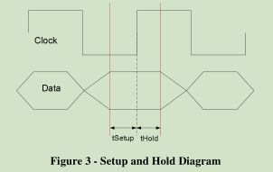

# liberty

## 概念

### internal_power

internal_power表示内部功耗。

在集成电路中，内部功耗是指电路在运行时产生的功耗，主要由电流通过晶体管、电阻和电容器等器件所导致。内部功耗与电路的结构、布局、时钟频率以及操作模式等因素有关。

Liberty文件中的internal_power部分描述了电路中各个组件的内部功耗特性，包括静态功耗（在电路处于稳定状态时产生的功耗）和动态功耗（在电路进行切换时产生的功耗）。这些功耗数据可以用于电路仿真、功耗分析和优化等应用。

### default_cell_leakage_power

default_cell_leakage_power（默认单元漏电功率）是电子设计自动化（EDA）工具中使用的一种指标。它用于描述集成电路设计中使用的默认逻辑单元（例如标准单元库中的基本逻辑门）在非开关状态下的漏电功耗。

默认单元漏电功率是根据制程和设备特性等参数进行估计或测量得到的，在设计过程中可以作为一个初始值或预估值使用。同时，它也可以用作电路级仿真和功耗分析的输入之一。

对于一个特定的逻辑单元, 默认单元漏电功率通常表示其在固定电压条件下，在没有任何输入变化时的平均漏电功耗。它是根据制程规格、器件特性和电源电压等因素综合计算得出的。

在实际的IC设计中，设计人员可以根据具体需求和应用场景，通过对默认单元漏电功率进行调整、优化和验证，以达到不同功耗目标和电源管理策略的要求。

### leakage_power

leakage_power（漏电功率）指的是集成电路在非开关状态下产生的功耗。当电路处于稳定状态且没有输入变化时，由于微小的漏电流引起的功耗称为漏电功耗。

漏电功耗是由于晶体管在关闭状态下，由于外部条件和器件的物理特性导致的微弱电流的流动。这些微弱的电流会导致能量损耗，从而使芯片在不进行任何有意义的计算或操作时也会消耗功耗。

漏电功耗通常在制程和器件设计阶段就可以进行估计或测量，并在Liberty文件中进行描述。减少漏电功耗是IC设计中重要的目标之一，以提高芯片的功耗效率和延长电池寿命。在设计过程中，采用低漏电功耗技术、优化电源和地线布局以及使用合适的电源管理策略等方法可以降低漏电功耗。

### default_cell_leakage_power 和 leakage_power 区别和联系

区别：

1. default_cell_leakage_power是指默认单元（通常是标准单元库中的基本逻辑门）在非开关状态下的漏电功耗。它是一个预估的初始值，用于描述逻辑单元在没有输入变化时的平均漏电功耗。
2. leakage_power通常是指整个电路或特定电路组件在运行时的漏电功耗。它是基于实际电路的工作状态和输入变化情况下的漏电功耗。

联系：

1. default_cell_leakage_power可以作为一个初始值或预估值，在电路级设计中用于初步估计默认单元（例如标准单元）的漏电功耗。
2. 在电路级仿真和功耗分析中，可以通过对标准单元进行缩放、调整或替换，以根据实际电路的特性和应用需求得到更准确的整体漏电功耗（leakage_power）估计。

总结而言，"default_cell_leakage_power"是一个默认单元的漏电功耗的初始估计值，而"leakage_power"则更具体地表示整个电路或特定组件在实际工作状态下的漏电功耗。对于更准确的功耗分析和优化，通常需要基于实际电路进行具体的估算和仿真。

### related_pg_pin

related_pg_pin（相关的功耗引脚）是Liberty文件中的一个属性，用于描述与特定电路组件相关联的功耗引脚。

一个电路组件可能会拥有多个功耗引脚，其中一些引脚可能与其他电路组件的引脚相关联，这意味着它们在功耗上有一定的依赖关系。这种依赖关系可以通过在Liberty文件中使用"related_pg_pin"来表示。

通过将功耗引脚之间建立相关性，可以更准确地描述电路组件之间的功耗传递和相互作用。这对于进行功耗分析、时序分析以及电路级优化非常重要。通过定义相关的功耗引脚，可以在Liberty文件中捕捉到电路组件之间的正确的功耗关系，以提供准确的模型和仿真结果。

### power_lut_template

power_lut_template（功耗查找表模板）是Liberty文件中用于描述电路组件功耗的一种方法。它是一种基于查找表的功耗建模技术，在电路级别对组件的功耗进行近似和表示。

功耗查找表模板使用离散的电压和电流值来表示电路组件在不同工作条件下的功耗。具体来说，它定义了一个二维表格，其中的行和列分别代表电压和电流的离散取值。每个表格中的元素则表示相应电压和电流下的功耗值。

通过使用功耗查找表模板，可以相对准确地估计电路组件在不同电压和电流条件下的功耗。这种方法在进行大规模电路仿真和优化时可以提高仿真速度，同时也能够较好地适应不同工艺、温度和电压变化等因素对功耗的影响。

需要注意的是，功耗查找表模板是一种近似的建模方法，可能会引入一定的误差。在实际设计中，可以根据具体的需求和精度要求选择合适的模型方法来描述电路组件的功耗行为。

### transition

"Transition" 是指信号从一个稳态值过渡到另一个稳态值的过程。在数字电路中，信号的过渡通常是指从低电平（例如 0）到高电平（例如 1）或从高电平到低电平的变换。

信号的过渡过程包括上升时间和下降时间。上升时间是信号从低电平到高电平的转换时间，而下降时间则是信号从高电平到低电平的转换时间。

过渡时间对于电路的性能和正确操作非常重要。较短的过渡时间意味着信号在切换时更快地达到目标稳态值，可以提高电路的工作速度和响应能力。另一方面，过长的过渡时间可能导致信号失真、冲突以及功耗增加。

在数字电路设计中，设计人员需要考虑到信号的过渡时间，并通过合适的驱动能力、电源电压、负载容量等措施来优化信号的过渡过程。此外，过渡时间还与芯片的时钟频率、延迟以及噪声抑制等因素有关。

因此，"transition" 表示信号从一个稳态值到另一个稳态值的变化过程，并且在数字电路设计中是一个重要的参数。它直接影响着电路的性能、功耗和可靠性等方面。

### pg_pin

"pg_pin" 是电子设计中常见的术语，指的是 "Power Ground Pin"，即电源接地引脚。

在电路设计中，电源和接地是至关重要的。电源引脚用于提供电流和电压，而接地引脚则用于回流电流和提供电路的参考点。通过使用适当的电源和接地引脚布局，可以确保电路的正常运行和稳定性。

通常，芯片或集成电路上的每个功能模块都需要连接到电源引脚和接地引脚才能正常工作。这些引脚通常被指定为 "pg_pin"，以便在设计和布局过程中正确地连接电源和接地。在 PCB（Printed Circuit Board）设计中，也经常会使用 "pg_pin" 来指代与电源和接地相关的引脚。

正确连接和布局 "pg_pin" 对于电路的性能、噪声抑制、电气可靠性和 EMI（Electromagnetic Interference）控制等方面至关重要。因此，在设计和布局过程中，应仔细处理 "pg_pin"，遵循相关的电路规范和最佳实践。

### slew_derate_from_library

工艺比较落后时测量 slew 时，采用的 threshold 一般是 10% 和 90%，随着工艺变好，30%-70% 之间基本可以认为是线性的(linear)，所以现在生成liberty时一般就用 30% 和 70% 的值，但是要将该值翻倍，等效 10% 和 90%。所以延迟表中的值要乘以 **slew derate factor**(即 0.5)，才是 30% 和 70% 对应的结果。如果没有该属性(默认为1)，则延迟表中的值就是设置的值(slew_lower_threshold_pct_fall等)。

## timing_type

### setup/hold

### min_pulse_width / minimum_period

* min_pulse_width: 在时序逻辑中的时钟信号或其他信号的最小脉冲宽度要求。用来确保信号在时序逻辑中传播的时间足够长，以保证正确的数据传输和稳定的电路操作。

* minimum_period: 表示时钟信号的最小周期要求。用来确保时钟信号的频率不会过高，以防止电路操作过快而导致不稳定的行为或电路故障。对于同步电路而言，时钟信号的周期是关键的，因为它决定了电路的刷新速度和数据传输的时序性。

## memory

### timing 类型

pin 定义

|pin |description
|- |-
|CLK        | 时钟
|D[N:0]     | data
|DOUT[N:0]  | 输出 pin
|A[M:0]     | address 地址
|CN         | chip enable
|WE         | read/write enable
|BW         | bit write
|LS         | light sleep
|DS         | deep sleep
|SD         | shut down
|VDDP       | periphery voltage
|VDDA       | array voltage

需要的时序

* CLK   : 读写 cycle min_pulse_width，minimum_period
* DOUT  : transition、retention
* A     : 相对 CLK 的 setup/hold
* CN    : 相对 CLK 的 setup/hold

liberty timing arc

|pin |timing_type |related_pin |table_type
|- |- |- |-
|CK     | min_pulse_width,minimum_period        |CK     |rise/fall_constraint
|DOUT   |rising/falling_edge,combinational      |CK     |cell_rise/fall,retaing_rise/fall,rise/fall_transition
