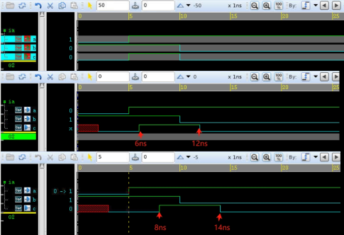

# verilog

[知乎-语法](https://zhuanlan.zhihu.com/p/72008467)
[菜鸟教程](https://www.runoob.com/w3cnote/verilog2-tutorial.html)

模型假设

> 模型假设（Modeling Assumptions）是指在建立电路仿真模型时所假设的一些条件和规定，这些条件和规定主要是为了保证该模型能够正确地进行仿真和验证，从而达到设计电路的目的。在 Verilog 文件的开头通常会列出该模型的假设条件和规定，方便使用者使用和理解该模型。常见的模型假设包括支持的仿真方式、支持的数据类型、模型中时序信息的处理方式、信号的响应特性等等。

## 基础概念

### `timescale

```verilog
// 设置时间单位和精度
// timeunit     : times 和 delays 时间单位
// timeprecision: delay 精度，在 simulation 前 delay 值会被精确到该单位
//                即使其他地方有更小的精度，也会精确到该单位
// 如 `timescale 1ns / 1ps 表示verilog中时间单位是1纳秒，仿真时时间精度为1皮秒
`timescale timeunit / timeprecision

```

### `define

```verilog
// 预处理指令，可以理解为 C 语言的 #define 宏
`define name value
// 取消宏
`undef name
// 引用宏
`name

// 加法宏
`define ADD(x, y) ((x) + (y))

reg [7:0] a=2;
reg [7:0] b=3;
reg [7:0] sum;
sum = `ADD(a,b);    // 调用加法宏函数计算 a 和 b 的和
```

### 条件编译指令

```verilog
`ifdef DEBUG_MODE
  module test_module;
    ...
  endmodule
`else
  ...
`endif
```

### 定义模块

```verilog
// D 触发器
module D_FF(CLK, D, Q);             // 定义模块(module)及端口(pin/port)
    input D;                        // 输入信号
    input CLK;                      // 时钟
    output Q;                       // 输出信号
    reg Q;                          // 寄存器或状态变量

    // 只要 CLK 变为上升沿(从 0 变为 1)就执行
    // always 表示该语句会一直执行
    // @(posedge CLK) 表示上升沿条件
    always @(posedge CLK) begin     
        Q <= D;
    end
endmodule
```

### 位选择/部分选择

bit-select, part-select

选择区间时高低对应关系必须和声明时一致(IEEE 5.2.1 章节)

```verilog
reg [0:9] a;
reg [9:0] b;

a[0:9] = 1;     // 正确
b[9:0] = 1;     // 正确

a[9:0] = 1;     // 错误
b[0:9] = 1;     // 错误
```

### 赋值

[赋值](https://zhuanlan.zhihu.com/p/625048683)

#### 过程赋值

主要使用与对 reg 类型变量赋值

阻塞赋值(=) 与 非阻塞赋值(<=)

```verilog
module test;
  reg a, b, ck;
  always #1 ck = ~ck;
  always @(posedge ck) begin
    // 阻塞赋值: a, b 值始终一致
    a = ck;
    b = a;

    // 非阻塞赋值: b 是上个时钟周期 a 的值
    a <= ck;
    b <= a;
  end

  initial begin
    $fsdbDumpfile("test.fsdb");
    $fsdbDumpvars;
    #8 $finish;
  end
endmodule
```

位宽不一致时

```verilog
ram[3:0] = di[3:0];   // 位宽一致，正常赋值
ram[3:0] = di[5:0];   // 只取 di 的低位赋给 ram，即 di[3:0]
ram[5:0] = di[3:0];   // 低位正常赋值，高位补 0，ram[5:4] = 2'b00, ram[3:0] = di[3:0]
```

#### assign 持续赋值

assign 是持续赋值，主要适用于对 wire 类型的变量赋值

```verilog
// a, b, c 为三个 wire 类型变量，a, b 的任何变化都将随时反应到 c 上
assign c = a & b;
```

### 数组

#### 二维数组

```verilog
// 4 行 8 列
reg [7:0] my_array [0:3];

// 声明时初始化
reg [7:0] my_array [0:3] = '{8'h11, 8'h22, 8'h33, 8'h44};

// 按索引赋值
my_array[1] = 8'hAA;

// 循环赋值
integer i;
integer j;
for (i = 0; i < 4; i = i + 1) begin
  for (j = 0; j < 8; j = j + 1) begin
    my_array[i][j] = 1'b0;
  end
end
```

### always @

```verilog
// @ 符号被称为“敏感词”，用于指定变量的敏感事件，从而建立时序逻辑电路
// @ 符号通常用于组合语句 always@( ) ，用于指定需要监听的变量或事件
// @ 符号后面用括号包围一个事件列表，用于指定某个条件的变化会触发该组合语句的执行
// @ 符号只能用于时序逻辑电路的描述中，无法用于组合逻辑电路的描述

// 该组合语句会在 clk 信号上升沿到来时执行更新操作
always @(posedge clk) 

// 如果我们希望监听多个变量或事件，可以使用逗号分隔它们
// 该组合语句会在 a、b 或 c 的值发生变化时执行更新操作
always @(a, b, c)
```

### 数字表示方法

```verilog
// 未设置位宽的数字
659             // 十进制
'h837FF        // 十六进制
'o7460          // 八进制
4af             // 非法

// 设置位宽的数字
4'b1001         // 4-bit 二进制
5'D3            // 5-bit 十进制
3'b01x          // 3-bit 二进制但是最后一位值未知
12'hx           // 12-bit 未知数

// high-impedance number（高阻抗数字）是一种特殊的数字类型
// 用于表示信号处于高阻抗状态
// 通常用于描述某些未连接部件的输出信号或者模拟电路中的开路状态
// 在进行计算时会产生严格的限制，并且不能与其他类型的数字进行运算
16'hz           // 16-bit 高阻抗数字

// 正负符号
8'd-6           // 非法
-8'd6           // 8-bit 十进制负数
```

#### 重复运算符 {}

```verilog
{4{1'b1}}   // 相当于 4'b1111
{4{2'b01}}  // 相当于 8'b01010101
```

### parameter

* parameter 不能在运行时即组合逻辑或时序逻辑中修改，但可以在编译阶段修改
* module 中的 parameter 可以在实例化时指定
* 作用域为当前 module

#### 定义与引用

```verilog
module test();
    parameter msb = 7;                  // 声明
    // 引用宏
    `name
    parameter e = 25, f = 9;            // 同时声明两个变量
    parameter r = 5.7;                  // 声明 r 为 real parameter
    parameter bs = 8,
              bs_mask = bs - 1;         // 使用变量赋值
    
    parameter [3:0] mux = 0;
    parameter real rl = 3.5e17;
    parameter p1 = 13'h7e;
    parameter [31:0] dec_const = 1'b1;  // 会自动转换为 32-bit
    parameter newconst = 3'h4           // 隐式 3-bit
endmodule
```

#### 定义/设置 module 参数

```verilog
// 定义参数
module test #(
  parameter PARAM1 = 1,
  parameter PARAM2 = 2,
  parameter PARAM3 = 3
  ) (
    input a,
    input b,
    output c
  );
endmodule

// 设置参数
module top();
  wire a, b, c;
  test #(.PARAM1(10), .PARAM3(30)) i_test(a, b, c);
endmodule
```

### ===

```verilog
// === 不仅会比较值，还会比较数据类型和位宽，都相同返回 true，否则 false
module example(input [3:0] A, input [3:0] B);

    // 当 A 和 B 完全相等时，输出结果为 true
    assign result1 = (A === B);    
    
    // 当 A 和 B 的值不完全相等时，输出结果为 false
    // 3'b101 表示 3bit 二进制数，其值为 101
    // 4'h5 表示 4bit 十六进制数，其值为 5
    assign result2 = (A[2:0] === 3'b101) && (B === 4'h5);
    
endmodule
```

### 内置门

```verilog
// x: 信号值未知或未定义
// z: 信号处于高阻抗状态，即未连接到任何有效电路或信号源

and  a1(out, in1, in2);         // 与门
nand n1(out, in1, in2);         // 与非门
or   o1(out, in1, in2);         // 或门
nor  n2(out, in1, in2);         // 或非门
xor  x2(out, in1, in2);         // 异或门
xnor x1(out, in1, in2);         // 同或门

not n1(out1, out2, in);
buf b1(out1, out2, in);
```

## 设置延迟(delay)

[延迟模型](https://www.runoob.com/w3cnote/verilog2-delay-type.html)

[specify](https://www.runoob.com/w3cnote/verilog2-specify.html)

### IOPATH

IOPATH 是点到点的延迟，如 input-pin => output-pin

test.sdf

```sdf
(DELAYFILE
  (SDFVERSION "OVI 3.0")
  (DIVIDER .)
  (TIMESCALE 1ns)
  (CELL
    (CELLTYPE "and2")
    (INSTANCE test.ia)
    (DELAY
      (ABSOLUTE
        (IOPATH a c (3)(3))
        (IOPATH b c (4)(4))
      )
    )
  )
)
```

test.v

```verilog
`timescale 1ns / 1ns    // 时间单位设为 1 纳秒

module and2(a, b, c);
    input a, b;
    output c;

    // 指定路径延时信息（会被sdf中的值覆盖）
    specify
        (a => c) = (1.0, 2.0);  // 上升延时 1，下降延时 2
        (b => c) = (1.0, 2.0);
    endspecify

    and(c, a, b);
endmodule

module test();
    reg a, b;
    wire c;
    initial begin
        $sdf_annotate("./test.sdf");    // 导入 sdf 文件，覆盖/反标specify中指定的延时
        a = 1'b0;
        b = 1'b1;
    #5  a = 1'b1;                       // 5 个时间单位后将 a 设为 1
    #5  b = 1'b0;                       // 再过 5 个时间单位后将 b 设为 1
    end

    initial #50 $finish;                // 50 个时间单位后退出

    and2 ia(.a(a), .b(b), .c(c));

endmodule
```

运行命令

```sh
vcs -kdb -debug_access+all test.v
./simv -verdi
```

结果



### setup/hold

setup/hold 图解: 示意图为相对于时钟(Clock)上升沿的setup/hold，setup表示从信号稳定时到时钟上升沿时间，hold表示从时钟上升沿到信号开始改变时间，在 **tSetup + tHold** 时间窗口内，信号需要保持稳定。更详细解释参考: manuals/ic/eda-tools/PrimeTime/PT_STA_Tool.pdf


test.sdf

```sdf
(DELAYFILE
  (SDFVERSION "OVI 3.0")
  (DIVIDER .)
  (TIMESCALE 1ns)
  (CELL
    (CELLTYPE "and2")
    (INSTANCE test.ia)
    (TIMINGCHECK
        (SETUP c (posedge clk) (6:6:6))     // 只设置clk上升沿的setup
        (HOLD c (posedge clk) (6:6:6))      // 只设置clk上升沿的setup

        // 带有条件的 SETUP/HOLD，COND 需要和 verilog specify $setup/$hold 中 &&& 后边的字符串一致
        (SETUP c (COND symbol_name1 clk) (6:6:6))
        (HOLD c (COND symbol_name2 clk) (6:6:6))
    )
  )
)
```

test.v

```verilog
`timescale 1ns / 1ns

module and2(a, b, c, clk);
    input a, b, clk;
    output reg c;

    wire symbol_name1;
    wire symbol_name2;
    assign symbol_name1 = a ? 1'b0 : 1'b1;
    assign symbol_name2 = a ? 1'b0 : 1'b1;

    parameter C_DELAY = 5;          // 定义 c 相对于时钟延时

    always @(clk) begin             // 时钟改变时改变 c 值
    // always @(posedge clk) begin  // 只在时钟上升沿修改
    // always @(negedge clk) begin  // 只在时钟下降沿修改
        #C_DELAY c = a & b;
        $display("%b %b %b", a, b, c);
    end

    // 指定 setup/hold 延时信息（会被sdf中的值覆盖）
    specify
        // 如果 c 跟随时钟下降沿变化且 c 的setup值大于 CLK_SW - C_DELAY, 
        // 即 c 在 tSetup 时间窗口内发生改变，则有 violation
        $setup(c, posedge clk, 2);          // 设置clk上升沿时setup
        // $setup(c, posedge clk, 6);       // 会有setup violation

        // 如果 c 跟随时钟上升沿变化且 c 的hold值大于 C_DELAY,
        // 即 c 在 tHold 时间窗口内发生改变，则有 violation
        $hold(posedge clk, c, 2);           // 设置clk上升沿hold
        // $hold(posedge clk, c, 6);        // hold violation

        // 带有条件(COND)的 setup/hold
        $setup(c, clk &&& symbol_name1, 2);  // clk变化且symbol_name1为1时，设置setup值
        $hold(clk &&& symbol_name2, c, 2);   // clk变化且symbol_name2为1时，设置hold值
    endspecify

endmodule

module test();
    reg a, b;
    wire c;

    parameter CLK_SW = 10;              // 定义时钟翻转间隔

    reg clk;
    initial begin
        $sdf_annotate("./test.sdf");    // 导入 sdf 文件，覆盖/反标specify中指定的延时
        clk = 0;
        a = 1'b0;
        b = 1'b1;
        forever begin
            a = ~a;
            #CLK_SW clk = ~clk;         // 定义时钟
        end
    end

    initial #100 $finish;

    and2 ia(.a(a), .b(b), .c(c), .clk(clk));
endmodule
```

## 函数

### display

|symbol | desc
|- |-
|%d     | 整数
|%f     | 浮点数
|%e     | 科学计数法
|%b     | 二进制，显示时 **低位在前**
|%h     | 十六进制
|%s     | 字符串
|%t     | 时间，显示为浮点数
|%m     | 时序，显示为 [x ns] 或 [x ps]
|%g     | 通用格式

输出到命令行(会自动换行)

```verilog
reg [7:0] sig;
display("sig value: %h", sig);
```

### time/realtime

仿真开始到当前位置时间

```verilog
// 显示当前仿真时间，单位为时钟周期
$display("Current simulation time is %0d", $time);

// 或者显示为浮点数形式，代表时间单位
$display("Current simulation time is %0t ns", $realtime);
```

### random

生成无符号整数，范围: $[0, 2^{64} - 1]$

### fsdbDumpvars

将仿真期间的变量写入 fsdb 文件

```verilog
fsdbDumpvars(<filehandle>, <variable_list>);

// 什么都不指定表示记录所有变量
fsdbDumpvars;

// 记录多个变量
fsdbDumpvars(1, clk, di, do);
```

### 命令行条件参数

```verilog
$test$plusargs        // 检查是否指定了某参数
$value$plusargs       // 检查是否将某参数指定为某值
```

根据运行时是否指定了命令行选项决定是否运行代码

```verilog
// test.v
module test;
  integer WIDTH;
  initial begin
    // 检查是否在命令行指定参数
    if ($test$plusargs("TEST_ARG")) begin
        $display("TEST_ARG SET");
    end

    // 从命令行获取参数 WIDTH 的值
    if ($value$plusargs("WIDTH=%d", WIDTH)) begin
      $display("WIDTH is set to %d", WIDTH);
    end
  end
endmodule
```

```sh
vcs test.v -TEST_ARG +WIDTH=32
```

## 代码片段

### 定义时钟

```verilog
parameter CYCLE = 10;
always #(CYCLE*0.5) ck = ~ck;
```
