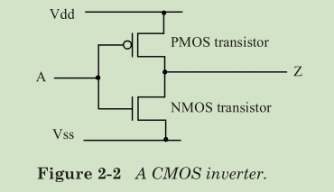

# 符号

## MOS 管

PMOS: 低电压导通，高电压关断(默认 **positive**)
NMOS: 低电压关断，高电压导通(默认 **negative**)

下图是一个反向器，**Z** 和 **A** 电平相反:
当 **A** 为低电平时: PMOS导通，NMOS关断，**Z** 和 **Vdd** 一致，即高电平
当 **A** 为高电平时: PMOS关断，NMOS导通，**Z** 和 **Vss** 一致，即低电平

## 逻辑门电路符号

与门、或门、非门

与非门、或非门

异或门、同或门

